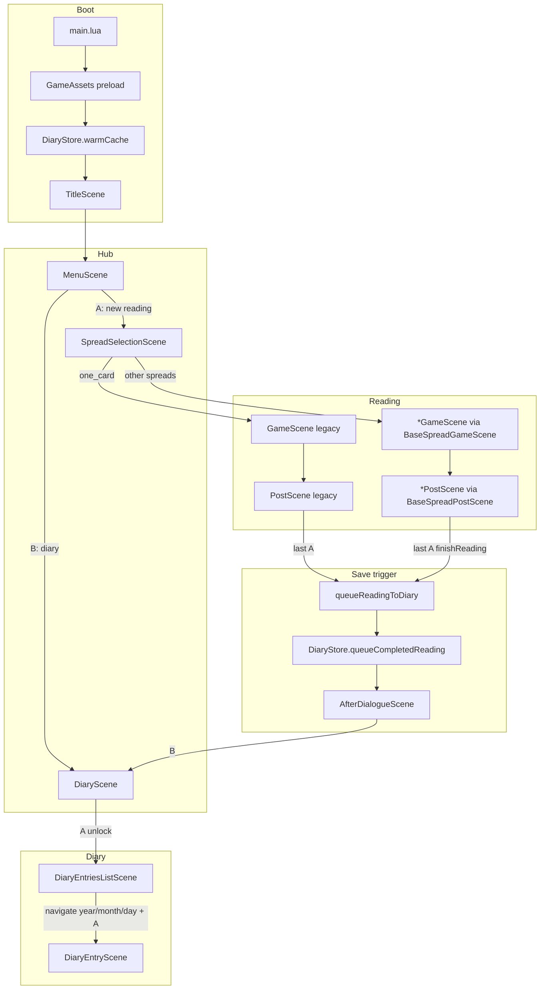
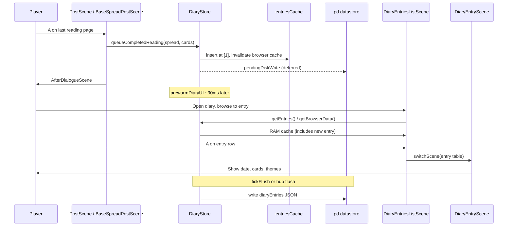

# Wee Tarot — Diary & Reading Save Flow

Map of the full player path from boot → reading → diary entry, with focus on **when diary data is loaded, saved, and shown**.

*As of current codebase.*

---

## Quick summary

| Moment | What happens to diary data |
|--------|---------------------------|
| **Boot** (preload done) | Diary JSON loaded into RAM cache; browser index prebuilt |
| **During reading** | Nothing saved yet |
| **Post scene — last A press** | New entry appended to **RAM** (`entriesCache`); disk write **queued** |
| **AfterDialogue hub** | Entry already visible in RAM; browser index rebuilt ~90ms after fade |
| **Disk flush** | Deferred ~180 idle frames, or explicit flush when leaving hub to Settings / new reading (A) |
| **Diary list** | Reads `DiaryStore.getEntries()` + `getBrowserData()` from RAM |
| **Diary entry view** | Receives the **entry table** passed from the list — does not re-read disk |

---

## End-to-end player flow



**Alternate diary entry:** `MenuScene` → B → `DiaryScene` (no reading required).

---

## 1. Boot — first load

**Files:** `main.lua`, `data/save/diaryStore.lua`

1. `main.lua` imports `diaryStore` at startup.
2. While `launchImage` is visible, `GameAssets.advancePreload()` runs one step per frame.
3. When preload completes:
   - `DiaryStore.warmCache()` runs once.
   - `TitleScene` starts.

### What `warmCache()` does

```
DiaryStore.getEntries()           → load from disk into entriesCache
DiaryStore.getBrowserData(false)  → build year/month/day index (ascending)
DiaryStore.getBrowserData(true)   → build year/month/day index (descending)
GameAssets.prewarmDiaryListAssets() → touch list UI images
```

### Load source priority (`loadEntriesFromStorage`)

1. **`pd.datastore.read("data/save/diaryEntries")`** — player save on device
2. If missing or empty → **`data/save/diaryEntries.json`** — bundled fallback (dev/shipped seed data)
3. All entries pass through `sanitizeEntry()` (date, time, spread key, cards)

### Every frame after boot

`main.lua` → `DiaryStore.tickFlush(SCENE_MANAGER.transitioning)`

- If a save is pending and the player is **idle ~180 frames** (~3s) and **not** in a scene transition → `flushPendingAppend()` writes JSON to disk.
- Scene transitions reset the idle countdown (avoids hitch during fades).

---

## 2. Hub → spread selection

| From | Button | To |
|------|--------|-----|
| `TitleScene` | A | `MenuScene` |
| `MenuScene` | A (after intro) | `SpreadSelectionScene` |
| `MenuScene` | B | `DiaryScene` |
| `AfterDialogueScene` | A | `SpreadSelectionScene` |
| `AfterDialogueScene` | B | `DiaryScene` |

`SpreadSelectionScene:confirmSelection()` sets global `selectedDeck` and routes:

| Spread key | Game scene |
|------------|------------|
| `one_card` | `GameScene` (legacy) |
| `three_card` | `ThreeCardGameScene` |
| `pentagram` | `PentagramGameScene` |
| `celtic_cross` | `CelticCrossGameScene` |
| `horoscope` | `HoroscopeGameScene` |

---

## 3. Reading → post scene (no diary I/O yet)

### Legacy one-card path

`GameScene` → on confirm → `PostScene(cardName, cardNumber, cardSuit, isInverted)`

### Modern spread path

`BaseSpreadGameScene` → on confirm → `self.config.postSceneClass` with:

```
cardNames, cardNumbers, cardSuits, cardInverted, selectedCardIndex
```

Each `*PostScene` extends `BaseSpreadPostScene` and passes a `CONFIG` with `spreadKey` (e.g. `"three_card"`).

**Post scene `init`:** stores card data only. Builds Dinah/scroll visuals on a delayed timer. **No diary read or write on entry.**

---

## 4. When the reading is saved

Saving happens **only when the player finishes the post-scene reading text** — not on shuffle, reveal, or post entry.

### Legacy `PostScene`

**Trigger:** last page of scroll text, player presses **A**

```
PostScene:update()
  → queueReadingToDiary()
  → SCENE_MANAGER:switchScene(AfterDialogueScene)
```

### `BaseSpreadPostScene` (all other spreads)

**Trigger:** last text page, player presses **A**

```
BaseSpreadPostScene:update()
  → finishReading()
      → queueReadingToDiary()
      → SCENE_MANAGER:switchScene(AfterDialogueScene)
```

**B button** on post scene → `goBackToSpreadView()` (return to card layout). **Does not save** unless `getSpreadGameSceneClass()` returns nil (then falls through to `finishReading()`).

### `queueReadingToDiary()` (both paths)

Guarded by `self.diaryEntrySaved` (only runs once per post visit).

Calls:

```lua
DiaryStore.queueCompletedReading(spreadType, cards)
```

- **Legacy:** `spreadType = "one_card"`, one card in `cards` table
- **Base spread:** `spreadType = self.config.spreadKey`, cards from `buildDiaryCards()` (name, number, suit, inverted, position per card)

---

## 5. DiaryStore save mechanics

**File:** `data/save/diaryStore.lua`

### `queueCompletedReading(spreadType, cards)`

Builds entry:

```lua
{
  date = DiaryStore.formatDateFromSystem(),  -- DD-MM-YYYY from pd.getTime()
  time = DiaryStore.formatTimeFromSystem(),  -- HH.MM
  spreadType = spreadType,                   -- normalized via SpreadReadingData
  cards = { ... }                            -- sanitized per card
}
```

Then → `scheduleAppend()` → `scheduleAppendPresanitized()`.

### RAM update (immediate)

```
entries = DiaryStore.getEntries()
table.insert(entries, 1, sanitizedEntry)   -- newest at front of array
entriesCache = entries
pendingDiskWrite = true
framesUntilFlush = 180
DiaryStore.invalidateBrowserCache()
```

**The new entry is visible in `getEntries()` immediately** — before any disk write.

### Disk write (deferred)

| Mechanism | When |
|-----------|------|
| `tickFlush()` | ~180 idle frames in `main.lua` update loop, if not transitioning |
| `AfterDialogueScene:flushDiaryToDiskIfNeeded()` | Player presses **Up** (Settings) or **A** (new reading) from hub |
| `appendEntry()` | **Unused** in current scenes — writes synchronously if called directly |

`writeCacheToDisk()`:

```lua
pd.datastore.write({ schemaVersion = 1, entries = entriesCache }, "data/save/diaryEntries", true)
```

### After save — browser index refresh

`AfterDialogueScene` schedules `DiaryStore.prewarmDiaryUI()` **90ms after fade** (RAM only, no disk write):

- Rebuilds `getBrowserData(false)` and `getBrowserData(true)`
- Prewarms diary list images

---

## 6. Diary entry data shape

Stored per entry (after sanitize):

```lua
{
  date = "DD-MM-YYYY",
  time = "HH.MM",
  spreadType = "three_card",  -- normalized key
  cards = {
    {
      name = "The Fool",
      number = 1,
      suit = 5,
      inverted = false,
      position = 1
    },
    -- ...
  }
}
```

**Not stored in diary:** full Dinah reading text, keywords from post scene, deck filter used. Those are rebuilt at view time from card names + `SpreadReadingData` where applicable.

---

## 7. Opening the diary after a reading

### Path after reading

```
AfterDialogueScene
  B → DiaryScene (cover / lock animation)
  A → unlock animation → DiaryEntriesListScene
```

### `DiaryEntriesListScene:init`

```lua
self.entries = DiaryStore.getEntries()                              -- RAM cache (includes new entry)
self.entriesListDescending = PlayerProfileStore.getEntriesListDescending()
self.browserData = DiaryStore.getBrowserData(self.entriesListDescending)
```

Browser modes:

1. **year** — pick year (plus Mend / Close rows)
2. **monthDay** — pick month (L/R), scroll days/entries (U/D)
3. **A on an entry row** → `openCurrentEntry()`

### `openCurrentEntry()`

```lua
SCENE_MANAGER:switchScene(DiaryEntryScene, selectedItem.entry, returnState)
```

Passes the **entry table reference** from browser data — not a disk reload.

### `DiaryEntryScene:init(entry, returnState)`

- `self.entry = entry` — date, time, spreadType, cards
- Renders spread summary + per-card detail from stored cards
- Card themes: `SpreadReadingData.pickKeywords(cardName, inverted, 3)` (generated at view time)
- Card images: loaded from deck image paths using stored name/number/suit
- **B** → back to `DiaryEntriesListScene` with `returnState` (restores list position)

### List ordering

- New entries inserted at index **1** of the entries array
- Within a day, order depends on `PlayerProfileStore.getEntriesListDescending()` (default: **oldest to newest** / `false`)
- Changeable in `DiarySettingsScene` → "Ordering"

---

## 8. What is NOT saved to diary

- Full paginated reading prose from post scene (`buildTextPages` / card descriptions)
- Whether player went back to spread view (B) before finishing
- Selected card index (only all drawn cards are stored)
- `selectedDeck` global at time of reading

---

## 9. Key files reference

| Role | Path |
|------|------|
| Boot + flush tick | `main.lua` |
| Diary persistence API | `data/save/diaryStore.lua` |
| Bundled seed / fallback JSON | `data/save/diaryEntries.json` |
| List sort preference | `data/save/playerProfileStore.lua` |
| Legacy save trigger | `scenes/postScene.lua` → `queueReadingToDiary` |
| Modern save trigger | `scenes/spreads/baseSpreadPostScene.lua` → `finishReading` / `queueReadingToDiary` |
| Post handoff from game | `scenes/spreads/baseSpreadGameScene.lua` |
| Legacy game handoff | `scenes/gameScene.lua` |
| Post-reading hub | `scenes/afterDialogueScene.lua` |
| Diary cover | `scenes/diaryScene.lua` |
| Diary browser | `scenes/diaryEntriesListScene.lua` |
| Single entry view | `scenes/diaryEntryScene.lua` |
| Spread display names / positions | `data/spreadReadingData.lua` |

---

## 10. Timeline (typical reading → new diary entry)

```
T0   Boot: diary loaded to RAM (warmCache)
T1   Player completes spread, enters post scene (no save)
T2   Player reads last page, presses A
     → queueCompletedReading → entry in RAM, pendingDiskWrite=true
     → switch to AfterDialogueScene
T3   ~90ms later: prewarmDiaryUI rebuilds browser index (RAM)
T3+  Player presses B → DiaryScene → A → DiaryEntriesListScene
     → getEntries() returns cache WITH new entry
     → navigate to today's date/month → A → DiaryEntryScene(entry)
T4   Eventually: tickFlush or hub flush writes JSON to device datastore
```

---

## 11. Two paths diagram (save focus)


